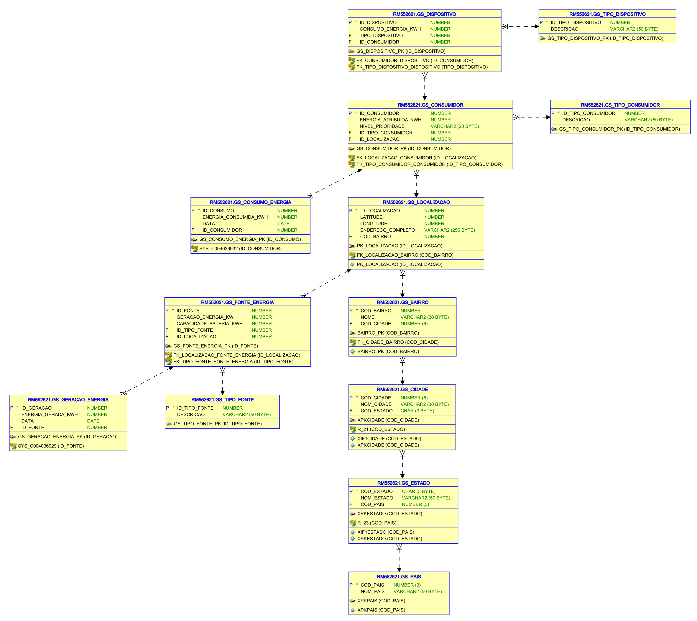
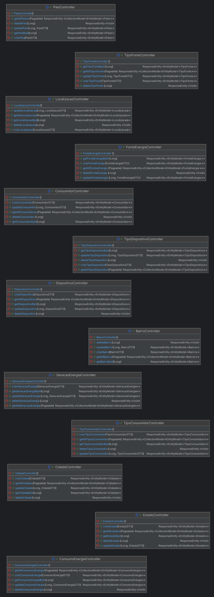
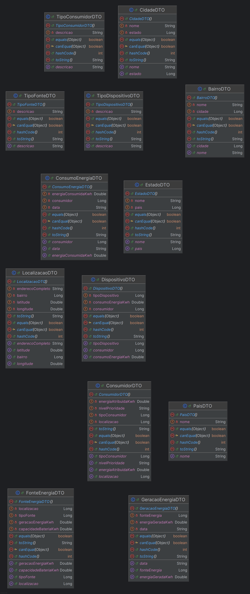
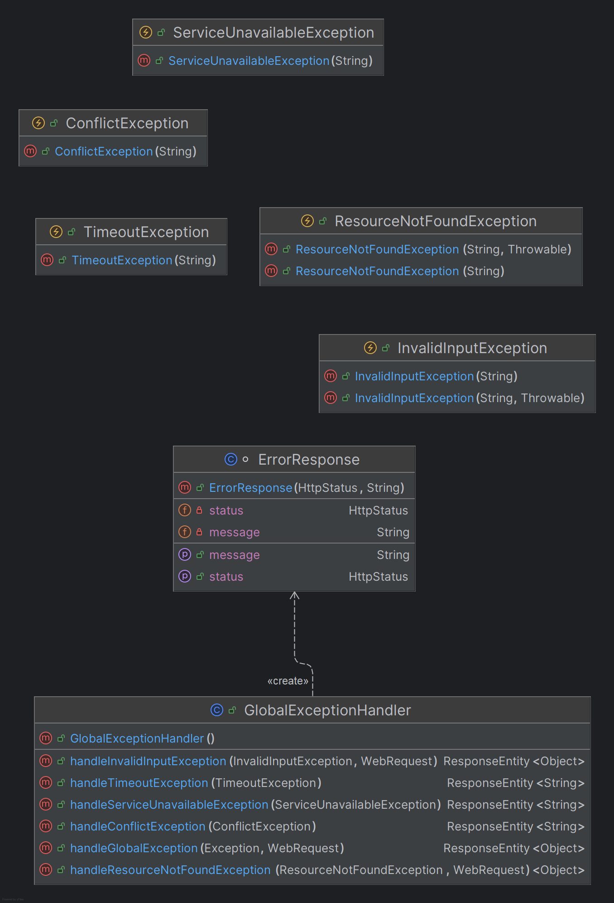
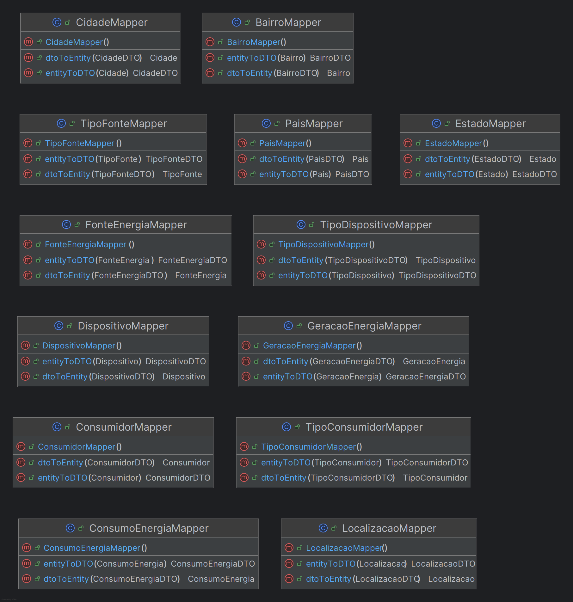
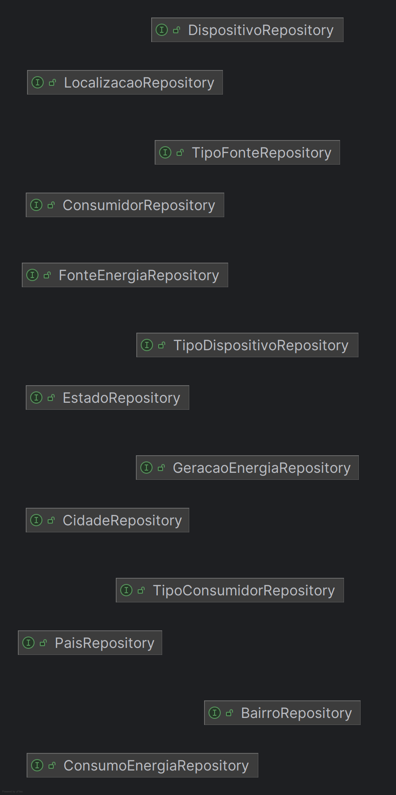
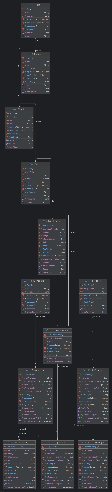

# ECOVOLT DATA MANAGEMENT
Este projeto foi desenvolvido como parte de uma solução tecnológica para comunidades remotas, com foco na previsão e otimização de geração e consumo de energia. Ele utiliza uma API RESTful construída com Spring Boot para gerenciar dados de geração e consummo de energia, fontes renováveis e etc. Essas comunidades frequentemente enfrentam dificuldades no acesso à energia confiável devido à variabilidade climática e à imprevisibilidade da demanda. A solução proposta busca mitigar esses desafios, facilitando a transição energética para sistemas renováveis, permitindo um planejamento mais eficiente e sustentável.

Este projeto tem potencial para ser implementado em soluções reais de monitoramento e gestão de energia, contribuindo para um futuro mais sustentável e seguro para as comunidades que dependem de energia renovável.

## Pré-requisitos

- Java 17 ou superior
- Gradle
- IDE de sua escolha (recomendado: IntelliJ IDEA)

## Instalação

1. Clone o repositório:
    ```bash
    git clone https://github.com/laLuna01/EcoVoltJava.git
    ```
2. Navegue até o diretório do projeto:
    ```bash
    cd EcoVoltJava
    ```
3. Compile o projeto usando Gradle:
    ```bash
    ./gradlew build
    ```
4. Execute a aplicação:
    ```bash
    ./gradlew bootRun
    ```

## Uso

A aplicação estará disponível em `http://localhost:8080`. Você pode usar ferramentas como Postman ou cURL para interagir com a API.

## Endpoints

### Fonte de energia

- **POST /fonteenergia**: Cria uma nova fonte de energia.
    - Exemplo: http://localhost:8080/fonteenergia
        - Json
        ```bash
        {
          "geracaoEnergiaKwh": 100,
          "capacidadeBateriaKwh": 400,
          "tipoFonte": 1,
          "localizacao": 1
        }
        ```
- **GET /fonteenergia**: Retorna todas as fontes de energia.
    - Exemplo: http://localhost:8080/fonteenergia?page={page}&size={size}&sort={sort}
- **GET /fonteenergia/{id}**: Retorna uma fonte de energia pelo ID.
    - Exemplo: http://localhost:8080/fonteenergia/{id}
- **PUT /fonteenergia/{id}**: Atualiza uma fonte de energia existente.
    - Exemplo: http://localhost:8080/fonteenergia/{id}
        - Json
        ```bash
        {
          "geracaoEnergiaKwh": 200,
          "capacidadeBateriaKwh": 500,
          "tipoFonte": 2,
          "localizacao": 2
        }
        ```
- **DELETE /fonteenergia/{id}**: Deleta uma fonte de energia.
    - Exemplo: http://localhost:8080/fonteenergia/{id}

### Consumidor

- **POST /consumidor**: Cria um novo consumidor.
    - Exemplo: http://localhost:8080/consumidor
        - Json
        ```bash
        {
          "energiaAtribuidaKwh": 1000,
          "nivelPrioridade": "Consumidor teste",
          "tipoConsumidor": 1,
          "localizacao": 1
        }
        ```
- **GET /consumidor**: Retorna todos os consumidores.
    - Exemplo: http://localhost:8080/consumidor?page={page}&size={size}&sort={sort}
- **GET /consumidor/{id}**: Retorna um consumidor pelo ID.
    - Exemplo: http://localhost:8080/consumidor/{id}
- **PUT /consumidor/{id}**: Atualiza um consumidor existente.
    - Exemplo: http://localhost:8080/consumidor/{id}
        - Json
        ```bash
        {
          "energiaAtribuidaKwh": 2000,
          "nivelPrioridade": "Consumidor testeeee",
          "tipoConsumidor": 2,
          "localizacao": 2
        }
        ```
- **DELETE /consumidor/{id}**: Deleta um consumidor.
    - Exemplo: http://localhost:8080/consumidor/{id}

### Dispositivo

- **POST /dispositivo**: Cria um novo dispositivo.
    - Exemplo: http://localhost:8080/dispositivo
        - Json
        ```bash
        {
          "consumoEnergiaKwh": 10,
          "tipoDispositivo": 1,
          "consumidor": 1
        }
        ```
- **GET /dispositivo**: Retorna todos os dispositivos.
    - Exemplo: http://localhost:8080/dispositivo?page={page}&size={size}&sort={sort}
- **GET /dispositivo/{id}**: Retorna um dispositivo pelo ID.
    - Exemplo: http://localhost:8080/dispositivo/{id}
- **PUT /dispositivo/{id}**: Atualiza um dispositivo existente.
    - Exemplo: http://localhost:8080/dispositivo/{id}
        - Json
        ```bash
        {
          "consumoEnergiaKwh": 100,
          "tipoDispositivo": 2,
          "consumidor": 2
        }
        ```
- **DELETE /dispositivo/{id}**: Deleta um dispositivo.
    - Exemplo: http://localhost:8080/dispositivo/{id}

### Tipo de consumidor

- **POST /tipoconsumidor**: Cria um novo tipo de consumidor.
    - Exemplo: http://localhost:8080/tipoconsumidor
        - Json
        ```bash
        {
            "descricao": "Tipo consumidor teste"
        }
        ```
- **GET /tipoconsumidor**: Retorna todos os tipos de consumidor.
    - Exemplo: http://localhost:8080/tipoconsumidor?page={page}&size={size}&sort={sort}
- **GET /tipoconsumidor/{id}**: Retorna um tipo de consumidor pelo ID.
    - Exemplo: http://localhost:8080/tipoconsumidor/{id}
- **PUT /tipoconsumidor/{id}**: Atualiza um tipo de consumidor existente.
    - Exemplo: http://localhost:8080/tipoconsumidor/{id}
        - Json
        ```bash
        {
            "descricao": "Tipo consumidor testeeeee"
        }
        ```
- **DELETE /tipoconsumidor/{id}**: Deleta um tipo de consumidor.
    - Exemplo: http://localhost:8080/tipoconsumidor/{id}

### Tipo de fonte

- **POST /tipofonte**: Cria um novo tipo de fonte.
    - Exemplo: http://localhost:8080/tipofonte
        - Json
        ```bash
        {
            "descricao": "Tipo fonte testeeeee"
        }
        ```
- **GET /tipofonte**: Retorna todos os tipos de fonte.
    - Exemplo: http://localhost:8080/tipofonte?page={page}&size={size}&sort={sort}
- **GET /tipofonte/{id}**: Retorna um tipo de fonte pelo ID.
    - Exemplo: http://localhost:8080/tipofonte/{id}
- **PUT /tipofonte/{id}**: Atualiza um tipo de fonte existente.
    - Exemplo: http://localhost:8080/tipofonte/{id}
        - Json
        ```bash
        {
            "descricao": "Tipo fonte testeeeee"
        }
        ```
- **DELETE /tipofonte/{id}**: Deleta um tipo de fonte.
    - Exemplo: http://localhost:8080/tipofonte/{id}

### Tipo de dispositivo

- **POST /tipodispositivo**: Cria um novo tipo de dispositivo.
    - Exemplo: http://localhost:8080/tipodispositivo
        - Json
        ```bash
        {
            "descricao": "Tipo dispositivo teste"
        }
        ```
- **GET /tipodispositivo**: Retorna todos os tipos de dispositivo.
    - Exemplo: http://localhost:8080/tipodispositivo?page={page}&size={size}&sort={sort}
- **GET /tipodispositivo/{id}**: Retorna um tipo de dispositivo pelo ID.
    - Exemplo: http://localhost:8080/tipodispositivo/{id}
- **PUT /tipodispositivo/{id}**: Atualiza um tipo de dispositivo existente.
    - Exemplo: http://localhost:8080/tipodispositivo/{id}
        - Json
        ```bash
        {
            "descricao": "Tipo dispositivo testeeeee"
        }
        ```
- **DELETE /tipodispositivo/{id}**: Deleta um tipo de dispositivo.
    - Exemplo: http://localhost:8080/tipodispositivo/{id}

### Consumo de energia

- **POST /consumoenergia**: Cria um novo consumo de energia.
    - Exemplo: http://localhost:8080/consumoenergia
        - Json
        ```bash
        {
          "energiaConsumidaKwh": 500,
          "data": "18-09-2023",
          "consumidor": 1
        }
        ```
- **GET /consumoenergia**: Retorna todos os consumos de energia.
    - Exemplo: http://localhost:8080/consumoenergia?page={page}&size={size}&sort={sort}
- **GET /consumoenergia/{id}**: Retorna um consumo de energia pelo ID.
    - Exemplo: http://localhost:8080/consumoenergia/{id}
- **PUT /consumoenergia/{id}**: Atualiza um consumo de energia existente.
    - Exemplo: http://localhost:8080/consumoenergia/{id}
        - Json
        ```bash
        {
          "energiaConsumidaKwh": 600,
          "data": "28-10-2024",
          "consumidor": 2
        }
        ```
- **DELETE /consumoenergia/{id}**: Deleta um consumo de energia.
    - Exemplo: http://localhost:8080/consumoenergia/{id}

### Geração de energia

- **POST /geracaoenergia**: Cria uma nova geração de energia.
    - Exemplo: http://localhost:8080/geracaoenergia
        - Json
        ```bash
        {
          "energiaGeradaKwh": 1000,
          "data": "23-02-2021",
          "fonteEnergia": 1
        }
        ```
- **GET /geracaoenergia**: Retorna todas as gerações de energia.
    - Exemplo: http://localhost:8080/geracaoenergia?page={page}&size={size}&sort={sort}
- **GET /geracaoenergia/{id}**: Retorna uma geração de energia pelo ID.
    - Exemplo: http://localhost:8080/geracaoenergia/{id}
- **PUT /geracaoenergia/{id}**: Atualiza uma geração de energia existente.
    - Exemplo: http://localhost:8080/geracaoenergia/{id}
        - Json
        ```bash
        {
          "energiaGeradaKwh": 2000,
          "data": "23-02-2022",
          "fonteEnergia": 2
        }
        ```
- **DELETE /geracaoenergia/{id}**: Deleta uma geração de energia.
    - Exemplo: http://localhost:8080/geracaoenergia/{id}

### País

- **POST /pais**: Cria um novo país.
    - Exemplo: http://localhost:8080/pais
        - Json
        ```bash
        {
          "nome": "Pais teste"
        }
        ```
- **GET /pais**: Retorna todos os países.
    - Exemplo: http://localhost:8080/pais?page={page}&size={size}&sort={sort}
- **GET /pais/{id}**: Retorna um país pelo ID.
    - Exemplo: http://localhost:8080/pais/{id}
- **PUT /pais/{id}**: Atualiza um país existente.
    - Exemplo: http://localhost:8080/pais/{id}
        - Json
        ```bash
        {
          "nome": "Pais testeeeee"
        }
        ```
- **DELETE /pais/{id}**: Deleta um país.
    - Exemplo: http://localhost:8080/pais/{id}

### Estado

- **POST /estado**: Cria um novo estado.
    - Exemplo: http://localhost:8080/estado
        - Json
        ```bash
        {
            "nome": "Estado teste",
            "pais": 1
        }
        ```
- **GET /estado**: Retorna todos os estados.
    - Exemplo: http://localhost:8080/estado?page={page}&size={size}&sort={sort}
- **GET /estado/{id}**: Retorna um estado pelo ID.
    - Exemplo: http://localhost:8080/estado/{id}
- **PUT /estado/{id}**: Atualiza um estado existente.
    - Exemplo: http://localhost:8080/estado/{id}
        - Json
        ```bash
        {
            "nome": "Estado testeeee",
            "pais": 2
        }
        ```
- **DELETE /estado/{id}**: Deleta um estado.
    - Exemplo: http://localhost:8080/estado/{id}

### Cidade

- **POST /cidade**: Cria uma nova cidade.
    - Exemplo: http://localhost:8080/cidade
        - Json
        ```bash
        {
            "nome": "Cidade teste",
            "estado": 1
        }
        ```
- **GET /cidade**: Retorna todas as cidades.
    - Exemplo: http://localhost:8080/cidade?page={page}&size={size}&sort={sort}
- **GET /cidade/{id}**: Retorna uma cidade pelo ID.
    - Exemplo: http://localhost:8080/cidade/{id}
- **PUT /cidade/{id}**: Atualiza uma cidade existente.
    - Exemplo: http://localhost:8080/cidade/{id}
        - Json
        ```bash
        {
            "nome": "Cidade testeeee",
            "estado": 2
        }
        ```
- **DELETE /cidade/{id}**: Deleta uma cidade.
    - Exemplo: http://localhost:8080/cidade/{id}

### Bairro

- **POST /bairro**: Cria um novo bairro.
    - Exemplo: http://localhost:8080/bairro
        - Json
        ```bash
        {
            "nome": "Bairro teste",
            "cidade": 1
        }
        ```
- **GET /bairro**: Retorna todos os bairros.
    - Exemplo: http://localhost:8080/bairro?page={page}&size={size}&sort={sort}
- **GET /bairro/{id}**: Retorna um bairro pelo ID.
    - Exemplo: http://localhost:8080/bairro/{id}
- **PUT /bairro/{id}**: Atualiza um bairro existente.
    - Exemplo: http://localhost:8080/bairro/{id}
        - Json
        ```bash
        {
            "nome": "Bairro testeeee",
            "cidade": 2
        }
        ```
- **DELETE /bairro/{id}**: Deleta um bairro.
    - Exemplo: http://localhost:8080/bairro/{id}

### Localização

- **POST /localizacao**: Cria uma nova localização.
    - Exemplo: http://localhost:8080/localizacao
        - Json
        ```bash
        {
          "latitude": 123,
          "longitude": 123,
          "enderecoCompleto": "Localizacao teste",
          "bairro": 1
        }
        ```
- **GET /localizacao**: Retorna todas as localizações.
    - Exemplo: http://localhost:8080/localizacao?page={page}&size={size}&sort={sort}
- **GET /localizacao/{id}**: Retorna uma localização pelo ID.
    - Exemplo: http://localhost:8080/localizacao/{id}
- **PUT /localizacao/{id}**: Atualiza uma localização existente.
    - Exemplo: http://localhost:8080/localizacao/{id}
        - Json
        ```bash
        {
          "latitude": 1234.56,
          "longitude": 1234.56,
          "enderecoCompleto": "Localizacao testeeee",
          "bairro": 2
        }
        ```
- **DELETE /localizacao/{id}**: Deleta uma localização.
    - Exemplo: http://localhost:8080/localizacao/{id}
  
## Swagger

`http://localhost:8080/swagger-ui.html`

## Testes
- Vá até collections no postman e importe o arquivo .json

[https://EcoVoltJava/blob/master/documentos/testes_api_postman.json](https://github.com/laLuna01/EcoVoltJava/blob/master/docs/EcoVolt%20GS%20API.postman_collection.json)

## Diagrama de Entidade e Relacionamento


## Diagramas de Classes de Entidade

### Controllers


### Dtos


### Exceptions


### Mappers


### Repositories


### Models


## Alunos
<b>Luana Sousa Matos</b> RM552621
<b>Nicolas Martins</b> RM553478
